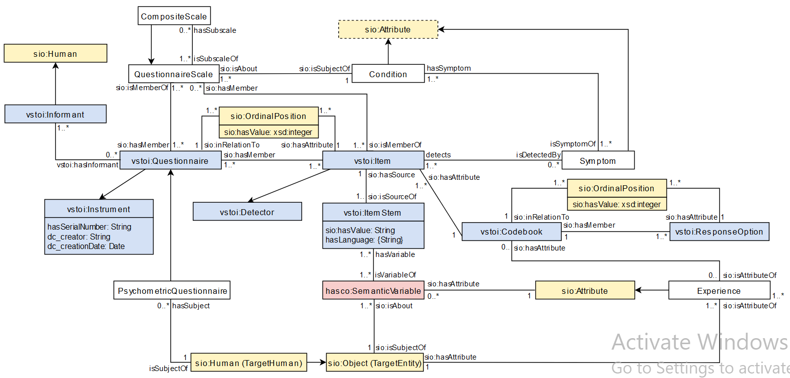

### Conceptual Diagram

This diagram gives an overview of important concepts included in the POEM ontology.

##### hasco:SemanticVariable

A *semantic variable* is a variable specification that does not include a population property; e.g. two variables have the same semantic variable when the only distinction between them is their population. The Entity (sio:Object/TargetHuman) and Attribute (sio:Attribute/SymptomExperience) properties of a *semantic variable* must be specified.

##### Symptom Experience

Each Response Option to an Item indicates some Symptom Experience; e.g. in Question 1 of the RCADS-47, which asks “I worry about things”, the “often” response indicates the Symptom Experience individual representing the experience of often feeling worry.

### Ontology

- [POEM][poem-current]

### Example Usage

- [POEM-RCADS][poem-rcads-current]
  - An example usage of the POEM ontology, showing how it is able to model questionnaires using the Revised Children's Anxiety and Depression Scale (RCADS)- full 47-item version and shorter 25-item version included.
  - [Revised Children's Anxiety and Depression Scale](https://www.childfirst.ucla.edu/resources/) created by Dr. Bruce Chorpita (UCLA)
- RCADS Item Bank with primary RCADS classes as each column (Note: medical terms are mapped to [SNOMED-CT](https://browser.ihtsdotools.org/?) and DSM 4/5 when possible). Information in green columns are available by viewing an RCADS questionnaire document, blue columns show information available in RCADS documentation, and red columns show semantic information provided by the team behind the creation and maintenance of the RCADS.

<iframe height="600" width="100%" src="https://docs.google.com/spreadsheets/d/e/2PACX-1vT2HBqddB5CrCGWq3awaNIMcpHjOE_ugQcsE0Jfj2U3g2EXSv6XSIB5FbID59RwbeGEapQ-d-GOw6jl/pubhtml?gid=1495634589&amp;single=true&amp;widget=true&amp;headers=false"></iframe>

### Ontologies Reused

| Ontology                                | Prefix | Resource                                                                                     |
|-----------------------------------------|--------|----------------------------------------------------------------------------------------------|
| Human-Aware Science Ontology            | hasco  | [https://hadatac.org/description/ont/hasco](https://hadatac.org/description/ont/hasco)       |
| Virtual Solar Terrestrial Observatory   | vsto   | [https://hadatac.org/description/ont/vstoi](https://hadatac.org/description/ont/vstoi)       |
| Semanticscience Integrated Ontology     | sio    | [https://semanticscience.org/ontology/sio.owl](https://semanticscience.org/ontology/sio.owl) |

[poem-current]: https://raw.githubusercontent.com/tetherless-world/POEM/main/POEM.rdf?token=GHSAT0AAAAAACFDP63DLXPW45SZMFHELD2MZFRZDSQ
[poem-rcads-current]: https://raw.githubusercontent.com/tetherless-world/POEM/main/POEM-RCADS.rdf?token=GHSAT0AAAAAACFDP63DRO54JNYJXFSIXKGUZFRZMIQ
